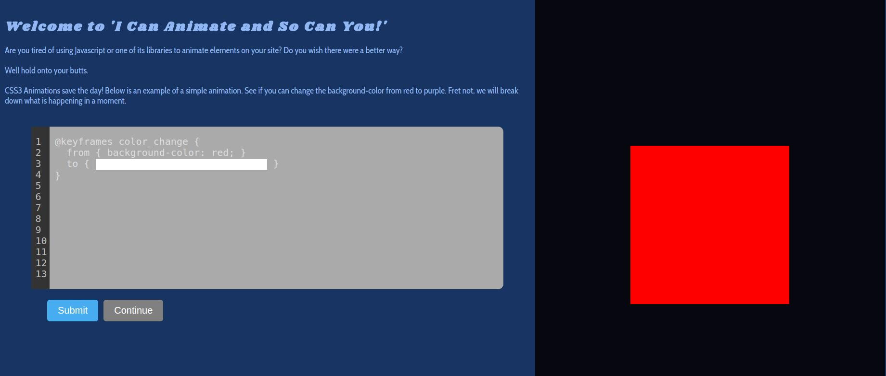
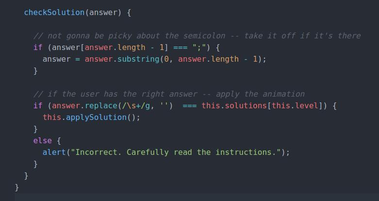
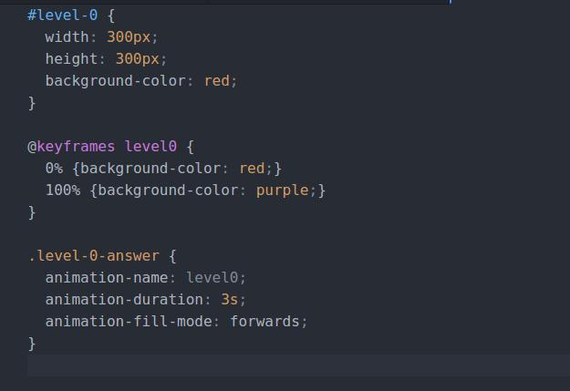

## 'I Can Animate and So Can You!'

[Live](http://dansulfaro.com/intro_to_animations/)

### Intro
'I Can Animate and So Can You!' is a 10-level quiz meant to act as an introduction to CSS3 Animations. I found Flexbox Froggy by Thomas Park a great tutorial on using Flex in CSS, but I noticed no such quiz existed for CSS3 animations which can be quite powerful and are easy to use so I used Park's site as my inspiration.

### Implementation
The app contains a single html file that acts as a template for 5 fields:
- Title
- Lesson
- Editor
- Display
- Solution

#### Rendering
I use a Game class to hold all of my game logic. The class has a level instance variable which is incremented every time the user inputs the correct solution.

Included in the class are 5 arrays that hold all the data for each section of the html page. When a level is loaded, I use the current level as the index for these arrays, and I use jQuery's .html method to load each section.

#### Solution Checking

I opted for string matching rather than rendering the user's input on the fly due to my time constraint. With regular CSS, I could set an interval on the keydown event of the input, parse the string, and then use jquery's .css method to render on the fly, however animations are not as simple and would require manipulation of the CSS Object Model.

#### Triggering Animations

To trigger the animation, I put the CSS that triggers the animation in a class and then use the .addClass method to append the level-#-answer class to the display div.
