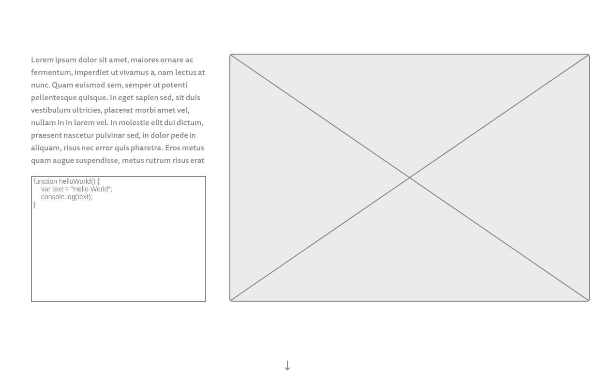

## Intro to CSS3 Animations

### Background
With CSS3 came animations which allow you to rotate, fade, twist, shift and just about any other animation you can think of without the use of Javascript. They can seem a little daunting at first so I wanted to create this small game in order to help coders learn this handy animations.

### Functionality and MVP
With this small game, users will be able to:
- progress through a series of 10 levels each with a mini lesson and coding exercise
- each exercise will have an input field in which the user must enter the correct code to create the animation
- the user won't be able to progress to the next level without entering the correct solution for the current level first

### Wireframes
The app will consist of a single page which scrolls vertically. Each frame will have a mini lesson in plain text, a text field right below that for input. And an area to the right that will display the animation.

### Architecture and Technologies
The app will be implemented using jQuery. I'm going to parse the input and see if it matches the correct solution. If it does, I will add the appropriate class which will then trigger the animation and allow the user to progress.

### Implementation Timeline
**Day 1** Design the "curriculum" of the game with all 10 levels, their problems and solutions all laid out and create intro page.

**Day 2** Levels 1-4

**Day 3** Levels 5-7

**Day 4** Levels 8-10

### Bonus Features
At the moment, I'm sort of cheating when it comes to checking the user's solutions. I'm parsing the string and seeing if it matches the answer and if it does, I'll append the class that actually contains the animation to that element which will then trigger the animation.

Basically, the user's input won't actually be rendered on the fly. Depending on how implementation goes, I may be able to do some extreme parsing and render the user's input as they are typing, but only if time allows.
